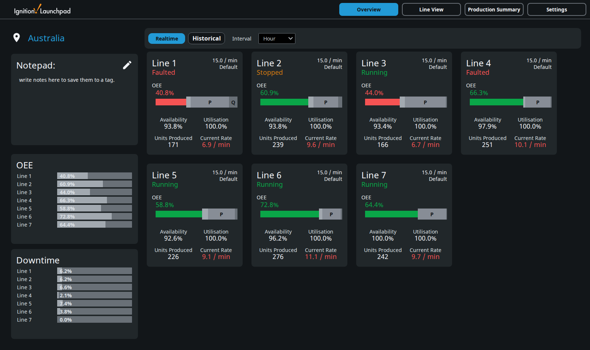
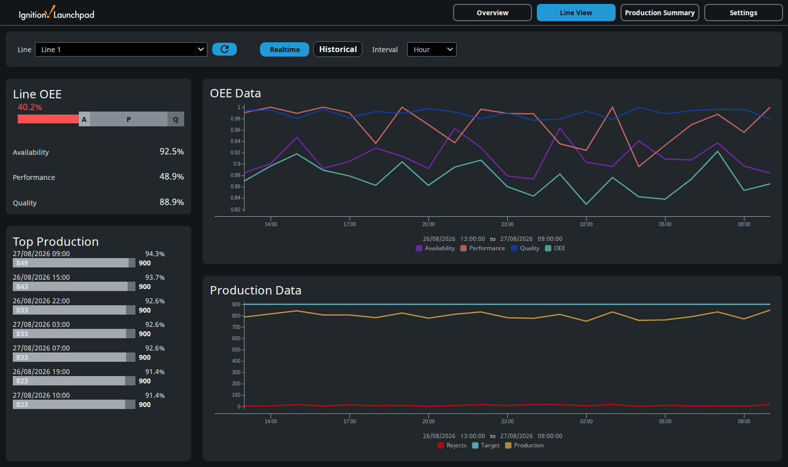
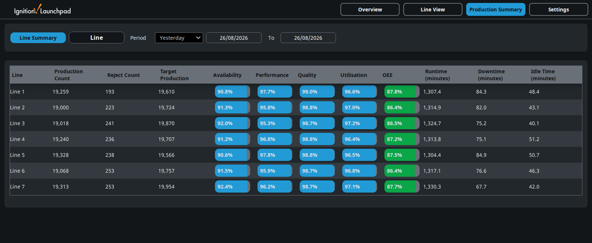
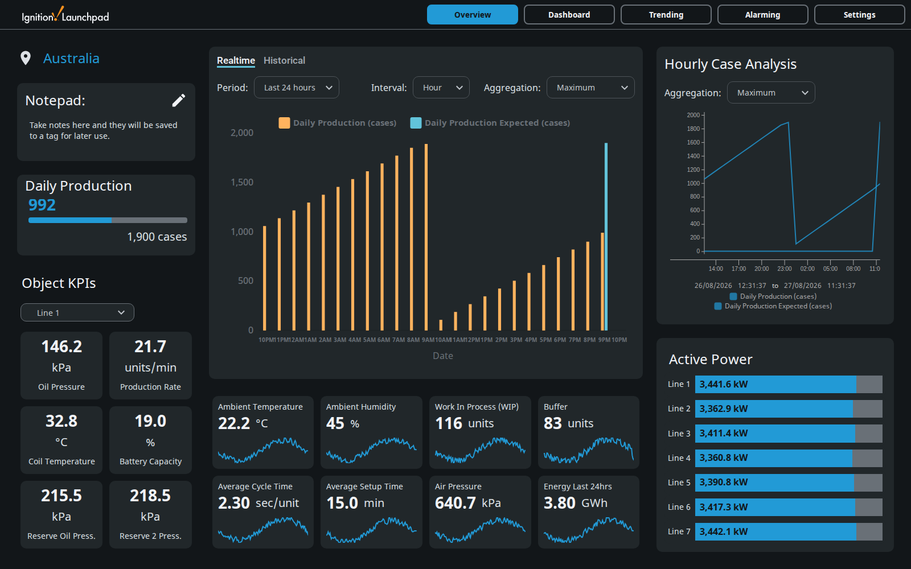
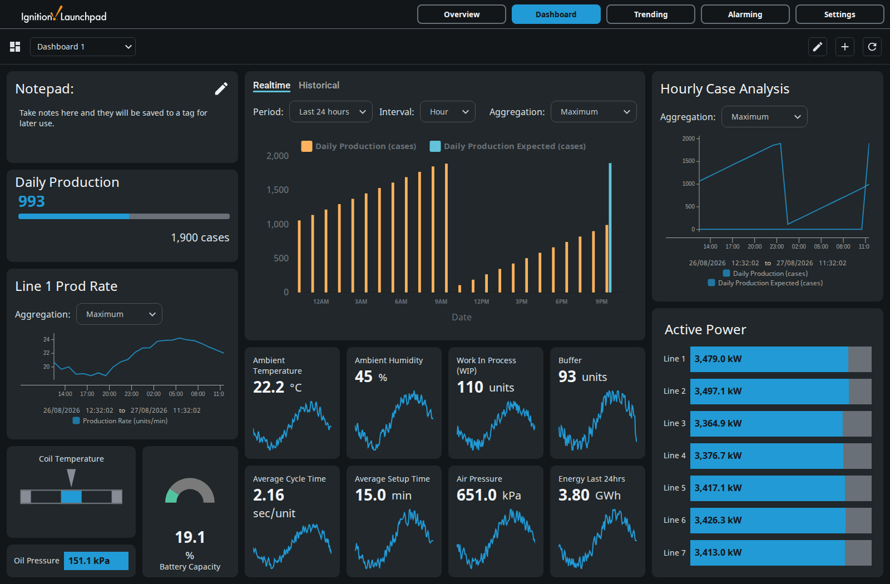
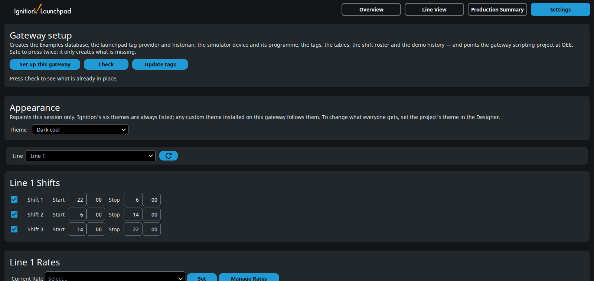
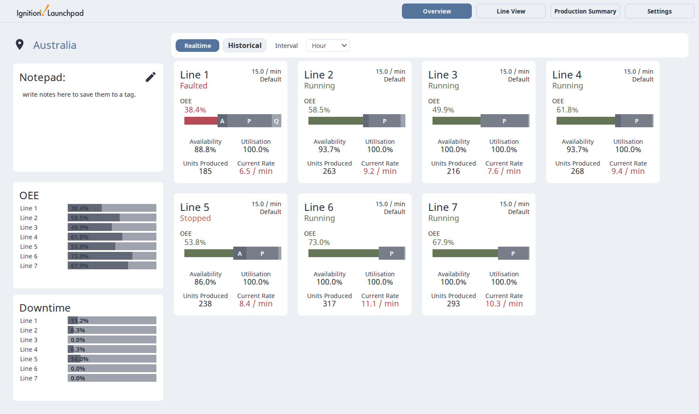

# Launchpad OEE + KPI — Australian port

Two Ignition 8.3 Perspective demo projects: **OEE** across seven simulated production
lines, and a plant **KPI** overview with a drag-and-drop dashboard.

## Why this exists

The Inductive Automation *Launchpad* Exchange resources are built around US units and
date conventions. This is a port to Australian ones — metric, DD/MM/YYYY, 24-hour time,
3 × 8h shifts — with the install reduced to one button. A simulator drives everything:
no PLC, no OPC server, no field device.

## What it looks like

*OEE — seven lines, live Availability / Performance / Quality / Utilisation.*

*Line View — per-line OEE and production against target.*

*Production Summary — every line, any period.*

*KPI — plant overview over 61 simulated instrument tags.*

*Dashboard — ten widget types, editable from the running session.*

*Settings — the whole install is the first card. The second picks the theme.*

*The same page under a light theme. Every colour but the chart series follows the
gateway's Perspective theme.*

## What it does

- **OEE** over seven lines — Availability, Performance, Quality and Utilisation per
  hour, shift and day, backed by SQL history.
- **KPI** over 61 instrument tags — dashboard, trending and alarms.
- **Self-contained.** The simulator and a SQLite database ship inside the projects.
- **A Setup button** that builds the gateway, and a **Check** button that reports it.
- **Themed.** Both projects follow the gateway's Perspective theme — Ignition's own
  six and any custom theme installed on the gateway. Pick one on Settings.

## How to use it

Two ordinary Ignition project exports. There is nothing to unpack and nothing to load
by hand.

1. Download `OEE-<version>.zip` and/or `KPI-<version>.zip` from the
   [latest release](../../releases/latest).
2. Import each via **Platform → Projects → Import Project**. Name them `OEE` and
   `KPI` — setup points the gateway scripting project at `OEE` by name. Either
   installs on its own.
3. Open the project's Settings screen and press **Set up this gateway**.

That's the install, and it starts from nothing. The button creates its own **database
connection** — SQLite at `${data}/Examples.db`, so no server and no credentials — then
the tag provider, historian, simulator and its programme, tags, UDT types, tables, shift
roster and demo history. Nothing has to exist on the gateway first. It only creates what
is missing, so pressing it twice is safe.

Two things it will not do. It won't repoint a gateway scripting project already set to
something else. And if a connection called `Examples` is already there and is *not*
SQLite, it stops on that step having created nothing — the schema is SQLite DDL, so
building on someone else's Postgres would half-create a schema rather than fail. Rename
or remove that connection and press **Set up this gateway** again.

For many gateways at once, `tools/install.sh` does the same over SSH.

### Themes

Settings → **Appearance** picks the theme for your session. The dropdown lists
Ignition's six, then every custom theme the gateway actually carries, read from its
own config resources — install a theme and it appears without the projects changing.
The shipped default is `dark-cool`, the stock theme closest to the palette this port
started from. To change what everyone gets rather than just your session, set the
project's theme in the Designer under Project Properties.

Chart **series** colours stay put across themes on purpose: a pen that changes hue
between two screens stops being recognisable, and these read on a light and a dark
ground alike.

If you use the Gaskony custom theme packs, these projects need **v1.5.1 or newer** of
them. Earlier packs declared `--containerBorder` as a colour where Ignition needs a
shorthand, which leaves inputs and dropdowns with no border at all. Ignition's own six
themes are unaffected and need nothing.

## What "AU" changes

The OEE engine, UDT structure and screen designs are the original's. What changed:

- **A one-click install.** The original is a set of resources you assemble by hand;
  here it's the Setup button above, which reports each step and is also exposed as a
  WebDev endpoint for scripting.
- **The pages laid out to fit** at a normal window size — verified at 1920×1080 and
  1600×900 against the rendered DOM — with a trimmed header and reformatted Production
  Summary tables.
- **Theme-driven colour.** The original paints a fixed dark palette; here every colour
  but the chart series resolves from the gateway's Perspective theme, so Ignition's
  own six and any custom theme all work. A `color-scheme` declaration comes with it,
  so Chrome's auto dark mode stops repainting the chart SVGs white — written against
  `html` rather than `:root`, so a theme's own declaration still wins.
- **Metric converted at source**, so tag metadata, axes, legends and history agree —
  a display-time conversion leaves the stored unit showing.
- **DD/MM/YYYY and 24-hour time**, including the chart components' own formats. Line
  View ticks follow the selected interval; Power Charts keep `Auto`, since the user
  drives their range.
- **3 × 8h shifts** (22:00 / 06:00 / 14:00) on all seven lines, with history to match.
- **A rolling realtime window** — 24 hours by hour, 7 days by shift, 30 days by day —
  so the screens are populated whatever hour you open them.
- **A flat tag layout**, `[Launchpad]OEE/…`, and history paths derived from the
  gateway's system name rather than baked in.

## Use it however you like

Take it, run it, change it, ship it. No permission needed, no strings.

**It is not maintained and comes with no support** — published because it may be useful,
not as a product. Fork it and make it yours.

## Licence and attribution

The Launchpad projects are published by **Inductive Automation** on the
[Ignition Exchange](https://inductiveautomation.com/exchange/); the original views,
scripts and tag structures are theirs, and are **not redistributed here** — get them
from the Exchange.

These are delivered as two ordinary project exports rather than as Exchange
resources, and are not published on the Exchange.

The MIT licence in [LICENSE](LICENSE) covers the changed and added work in this
repository, not Inductive Automation's underlying work. Ignition, Perspective and
Launchpad are their trademarks; this project is not affiliated with or endorsed by them.
